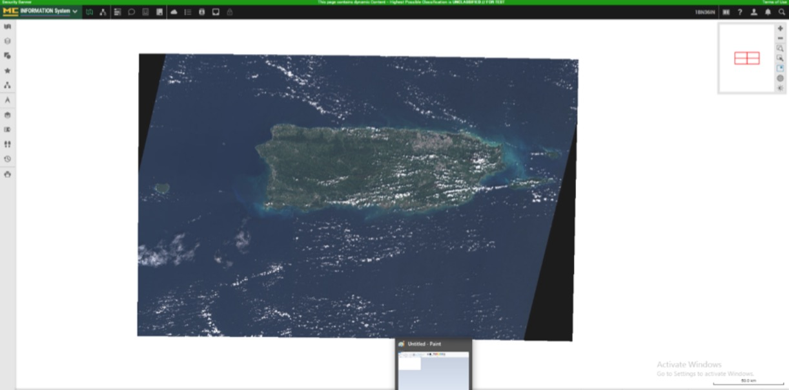
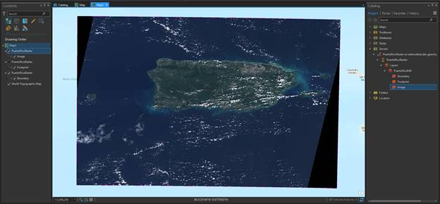
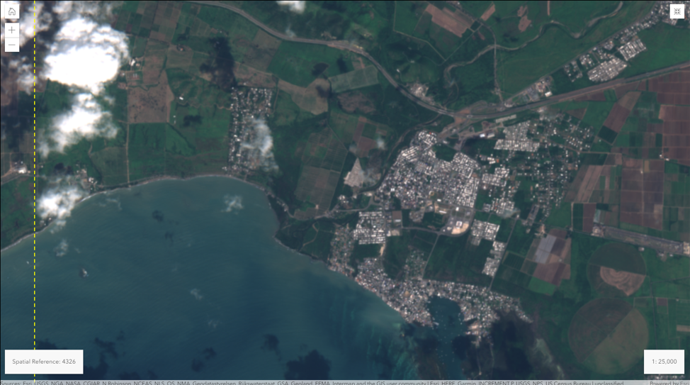
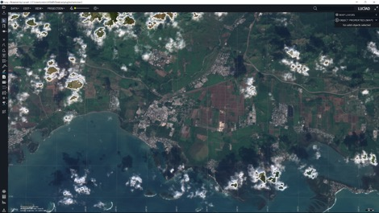
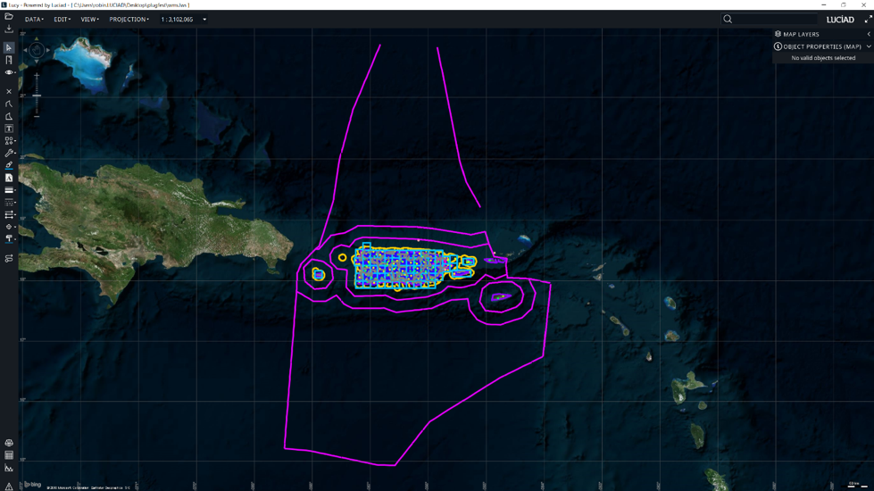
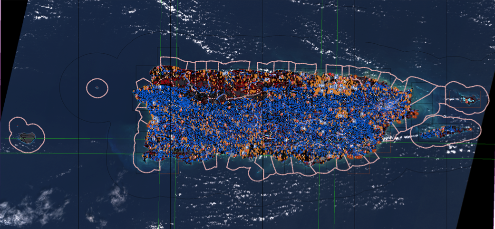

[[Results]]
== Results and Recommendations

=== Selected Screenshots
Following are some examples provide by the participants

image::images/ClientA-gpk-apollo-raster-Q1.JPG[title="Full extent raster data from GeoPackage with Client A and GeoPackage Vector Apollo"]

include::WMS.adoc[]

include::WFS.adoc[]

include::WMTS.adoc[]

include::geopackage.adoc[]
