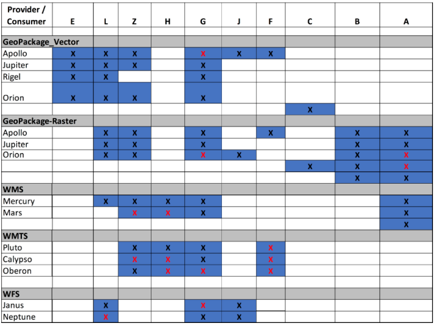
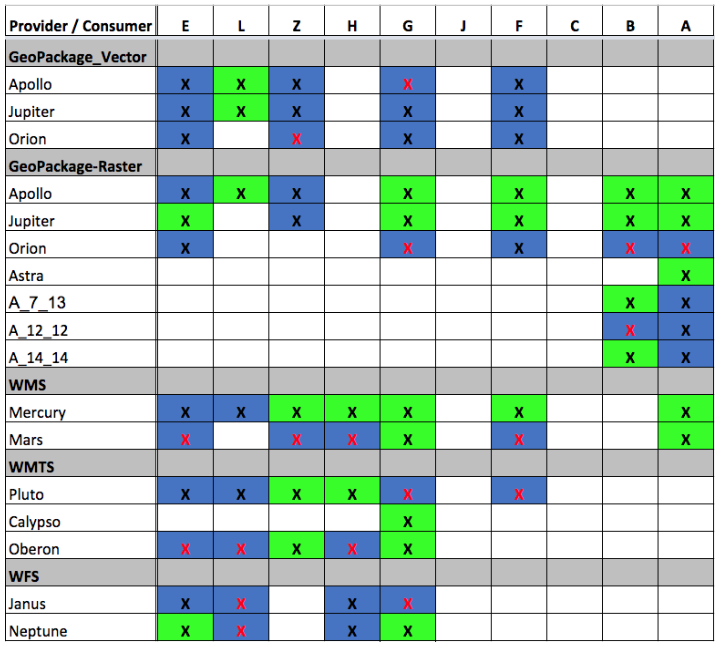
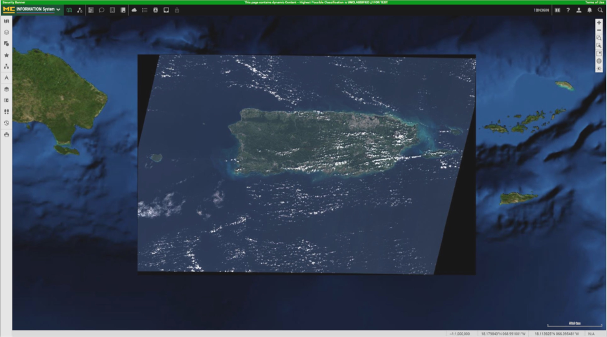

[[Results]]
== Results and Recommendations

=== Summary of Experiments

The results of Sprint 1 were summarized in the following table.

The red marks indicate that the client was not able to interact with the server. Overall most servers were able to communicate with the clients.

For Sprint 2 it was capture if the client was able to perform successfully all the tests with a particular source. The green cells indicate a successful interaction.

=== Selected Screenshots
Following are some examples provided by the participants:

image::images/ClientA-wms-mercury-Q1.jpg[title="Full extent raster data from WMS with Client A and WMS Mercury"]

image::images/ClientL-wms-mercury-Q1.jpg[title="Full extent raster data from WMS with Client L and WMS Mercury"]

image::images/ClientH-wms-mercury-Q4.png[title="1:25000 extent raster data from WMS with Client H and WMS Mercury"]

image::images/ClientG-wms-mercury-Q4.jpg[title="~1:25000 extent raster data from WMS with Client G and WMS Mercury"]

image::images/ClientG-wms-mars-vector-Q4.png[title="Vector and Raster data from WMS Mars by Client G"]

image::images/raster-vector-gpk.png[title="Client showing both GeoPackage vector and raster data"]

include::WMS.adoc[]

include::WFS.adoc[]

include::WMTS.adoc[]

include::geopackage.adoc[]
