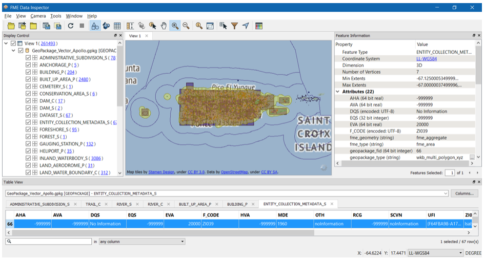
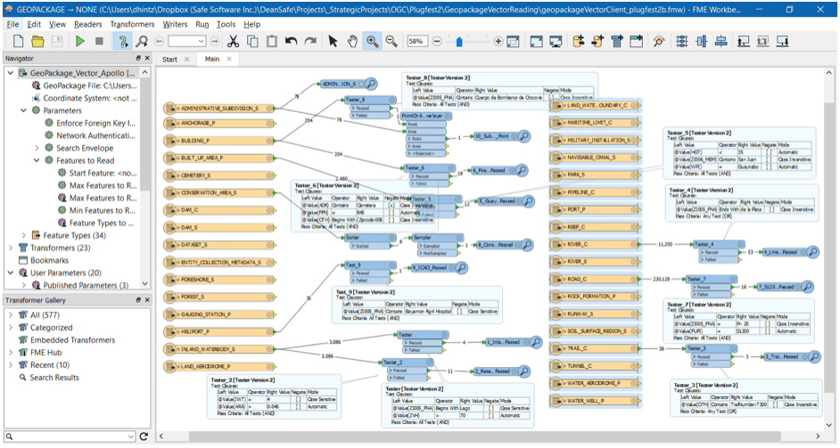

[[Applications]]
== Applications and strategies from implementers

This section provides direct feedback and recommendations from implementers about how to use their tools to interact with NSG profiles data and services.

=== FME raster and vector client

==== Vector queries
Vector queries in the FME Client can be performed two ways:
- interactively using FME Data Inspector as the client alone
- FME Workbench with a workspace script to automate the process

==== Raster queries
When FME is used to read a GeoPackage raster tile dataset, the Data Inspector client optimizes the display by balancing the displayed resolution with the zoom level. Unless a specific zoom level is chosen, FME automatically chooses the highest resolution zoom level that can be displayed at the extents chosen, and then resamples as needed.

=== Esri raster tiles server and GeoPackage

1) What were the steps you took to setup the mosaics?
ArcGIS Desktop was used to Create Mosaic Dataset (Data Management Tools) and to add the images into the dataset. When adding the images the default parameters were kept including the calculation of raster statistics. With the calculation of the statistics the mosaics remain interactive and available to further analysis.

2) How did you determine and process the zoom levels?
ArcGIS Desktop was used for publishing the Map Services with allows for the creation of 1-22 zoom levels. The default values were kept for all services.

3) Other tools?
For the creation of the GeoPackages, Esri turn to the Data Interoperability Tool as opposed to the Add Raster To GeoPackage (Conversion Tool).  Work is in progress to make the creation of GeoPackage files more straight forward, in particular, in ArcGIS Pro.

4) Did you went through any optimization process to save or speed up the delivery (or query) mechanism?
Esri built the queries into the JavaScript and .NET apps, which is easy to use by non-experts. In ArcGIS Pro, the SQL statements were copied and referred back to them for each data source. Nothing special was done to speed up the return of the requests.

5) Any other feedback about setting the data or services?
Esri stated that setting up the raster and vector GeoPackages, the WMS, WMTS, and WFS was fairly straight forward. Feedback was provided related to test engine irregularities. Esri achieved the goal to reduce the number of errors found in the NSG profiles.

=== GeoSolutions

==== Introduction

During this experiment two services where provided: WFS and WMTS, both based on the correspondent NSG profiles. The two services were made available with a single GeoServer instance and the necessary GeoServer NSG plugins, providing a different end-point for each service, i.e.  http://cloudsdi.geo-solutions.it/geoserver/geoedge/ows?service=wfs&version=2.0.1&request=GetCapabilities[WFS] and http://cloudsdi.geo-solutions.it/geoserver/geoedge/gwc/service/wmts?SERVICE=WMTS&REQUEST=GetCapabilities[WMTS].

The provided vector and raster https://github.com/opengeospatial/geoedge-plugfest/wiki/Data[data] was also configured in the server. Vector data was stored in a PostgreSQL database in the server. The database schema was adapted to support the NSG versioning needs. Auxiliary world files (.wld) where created for the raster data and directly stored on the file system and served through image mosaic  http://docs.geoserver.org/latest/en/user/data/raster/imagemosaic/index.html[GeoServer extension].
Clients tests feedback and the follow up was done with the support of GitHub issues. The provided WFS and WMTS services where respectively tagged as https://github.com/opengeospatial/geoedge-plugfest/labels/%40WFS_Neptune[WFS_NEPTUNE] and
https://github.com/opengeospatial/geoedge-plugfest/labels/%40WMTS_Calypso[WMTS_CALYPSO].
A total of six issues where reported for the WFS service and three issues for the WMTS service (in both sprints).

==== Data and services setup
1) What were the steps you took to setup the mosaics?
The raster data was published using GeoServer image mosaic http://docs.geoserver.org/latest/en/user/data/raster/imagemosaic/index.html[extension], which allows the user to publish a mosaic from a number of georeferenced rasters. An auxiliary world file (.wld) was created for each granule, and then an image mosaic datastore pointing to the granules directory was created in http://docs.geoserver.org/latest/en/user/data/raster/imagemosaic/tutorial.html[GeoServer].

2) How did you determine and process the zoom levels?
The already available image overviews were used as is, image mosaic takes care of matching the correct overview with the requested zoom level.

3) Other tools?
Tool ​ogr2ogr w​as used to insert the provided vector data into the PostgreSQL database and gdalinfo was used to get the necessary information to complete the auxiliary world files (.wld) content for each granule.

3) Did you went through any optimization process to save or speed up the delivery (or query) mechanism?
The raster files were already optimized, e.g. tiled, compressed and with overviews (zoom levels). For vector data, an index was created for each primary key column of each dataset.

4) Any other feedback about setting the data or services?
GeoServer NSG extensions and plugins (one for WFS and another one for WMTS) need to be http://docs.geoserver.org/stable/en/user/community/nsg-profile/index.html[installed].

When configuring the tile matrix sets for a certain layer, special care should be taken to select only tile matrix sets that make sense for the layer. By default all the tile matrix sets defined by the WMTS NSG profile were available.
