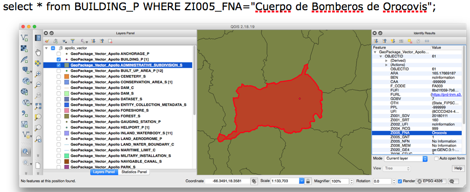

[[WFS]]
=== WFS

==== Axis order

Data providers should treat properly urn:ogc:def:crs:epsg::4326. The axis order is Latitude Longitude. This can happen in the following situations:

 1. When performing an HTTP request
 2. When returning data about a feature

The snippet code bellow shows an incorrect axis order for Puerto Rico.

.Example Incorrect XML Return
[source,xml]
----
<gml:MultiSurface     gml:id="INLAND_WATERBODY_S.5.pl" srsName="urn:ogc:def:crs:EPSG::4326" srsDimension="3"> <gml:surfaceMember> <gml:Polygon gml:id="INLAND_WATERBODY_S.5.pl.0" srsName="urn:ogc:def:crs:EPSG::4326" srsDimension="3"> <gml:exterior> <gml:LinearRing> <gml:posList>
  -66.57471640699998 18.36690177100007 0
  -66.57475487399995 18.36692017100006 0
  -66.57479807399994 18.36692930400005 0
  -66.57483167399994 18.36693850400007 0
  -66.57488447399999 18.36694770400004 0
  -66.57494700699993 18.36696597100007 0

----

Related issue: https://github.com/opengeospatial/geoedge-plugfest/issues/15

==== Query issues

Some queries seem difficult to execute. Several clients reported that Query 10 can't be executed:

  Query 10: Find the administrative subdivision that contains the building “Cuerpo de Bomberos de Orocovis”

The process might involve a 2 step process:

  1. Select the layer
  2. Run a query inside that layer: select * from BUILDING_P WHERE ZI005_FNA="Cuerpo de Bomberos de Orocovis";

Similarly it was reported that it was only possible to query one layer per request (https://github.com/opengeospatial/geoedge-plugfest/issues/52[Issue 52]).

A thin client didn't support attribute querying (https://github.com/opengeospatial/geoedge-plugfest/issues/85[Issue 85]).

Related issues:

- https://github.com/opengeospatial/geoedge-plugfest/issues/88
- https://github.com/opengeospatial/geoedge-plugfest/issues/52
- https://github.com/opengeospatial/geoedge-plugfest/issues/85

==== Interacting with different versions WFS

Some servers support multiple version of WFS. This server capability enables clients to get the data using the preferred version of a WFS.

//TODO:add information from Client J report  WFS Janus Final
