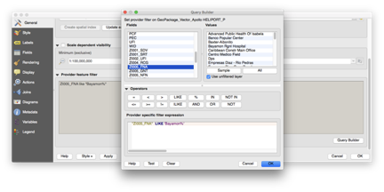

[[QGIS Client]]
 == QGIS Client

QGIS 2.18 client was used to test data and servers. Instructions about how to query  GeoPackage files using the QGIS layer filter are as follows:

 . Drag .gpkg file into QGIS window.
 . Click Select All to select all layers and click OK. Vector layers appear in left panel.
 . Double click vector layer to query in Layers Panel. Layer properties window opens.
 . Click General Tab.
 . Click Query Builder button at bottom of General Tab. Query Builder dialog opens.
 . Use query builder buttons and menus to reproduce SQL args which follow WHERE keyword in the complete SQL statements above.
 . Click OK.
 . Click OK.
 . Right click vector layer and select Show Feature Count.
 . Right click vector layer and select Zoom to Layer.

